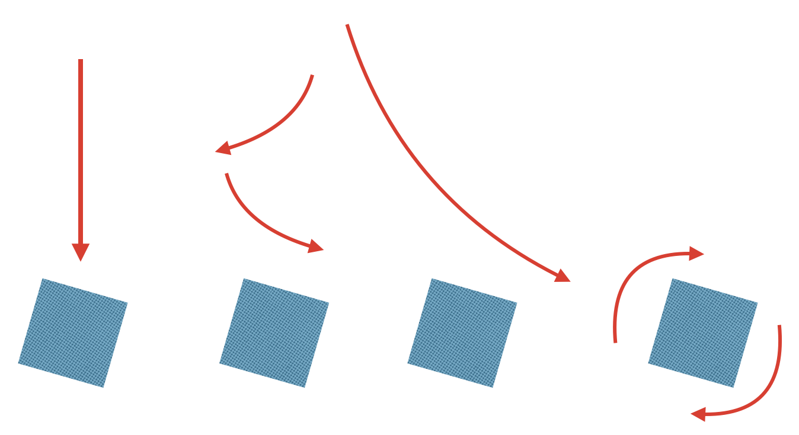

# kamihubuki-js の物理モデル

kamihubuki-js は質点の運動を基本としています。 質点は外力（重力、風、空気抵抗）を受けて運動します。

質点のモデルでは、紙吹雪は単純な放物線運動になります。また、質点は回転を扱えません。そこで、紙吹雪がひらひらと舞う様子を再現するため、質点にフィンを取り付けます。

フィンは質点からのばした腕の先端に取り付けられます。フィンは空気から受ける力を腕を通して質点に伝えます。この力で質点が移動します。フィンからの力で腕が回転することで、質点も回転します。フィン-腕は複数取り付けることができます。

フィンの取り付け方によって、紙吹雪の動きが変化します。

