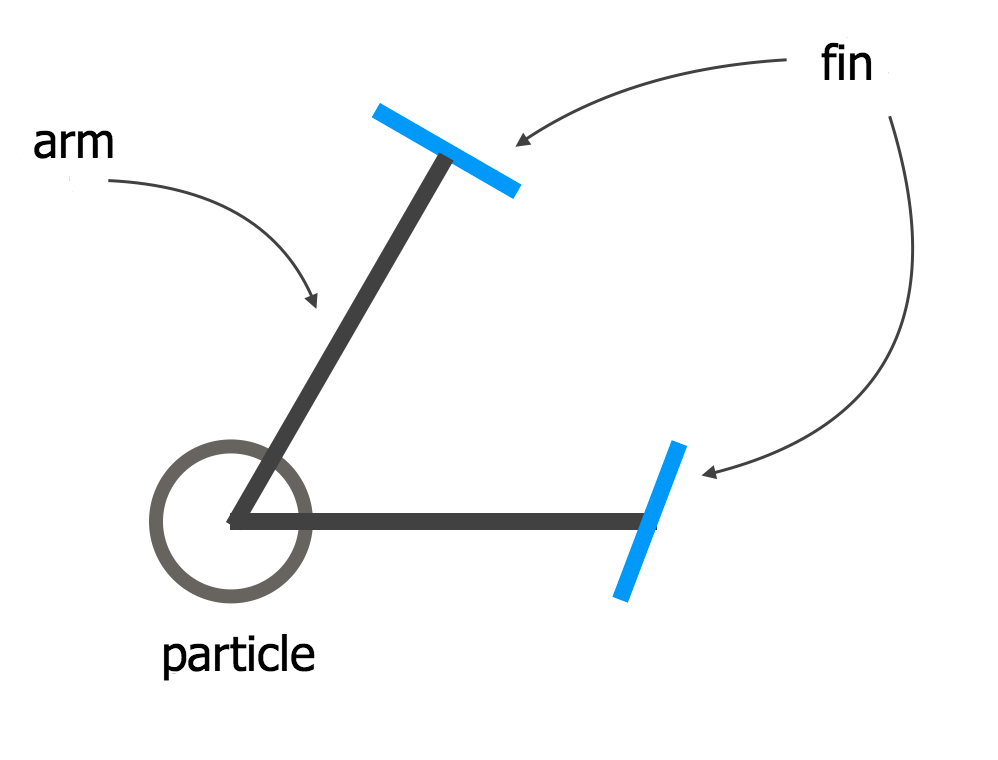

# kamihubuki-js confetti physics model

kamihubuki-js's confetti is based on particle model. External forces (gravity, wind, air resistance) work on it.

Arms with fins are attached to confetti to rotate.

Wind and air resistance push fins and result in a particle (confetti) rotation.

Confetti's movement will change in response to how arm-fins attached.

